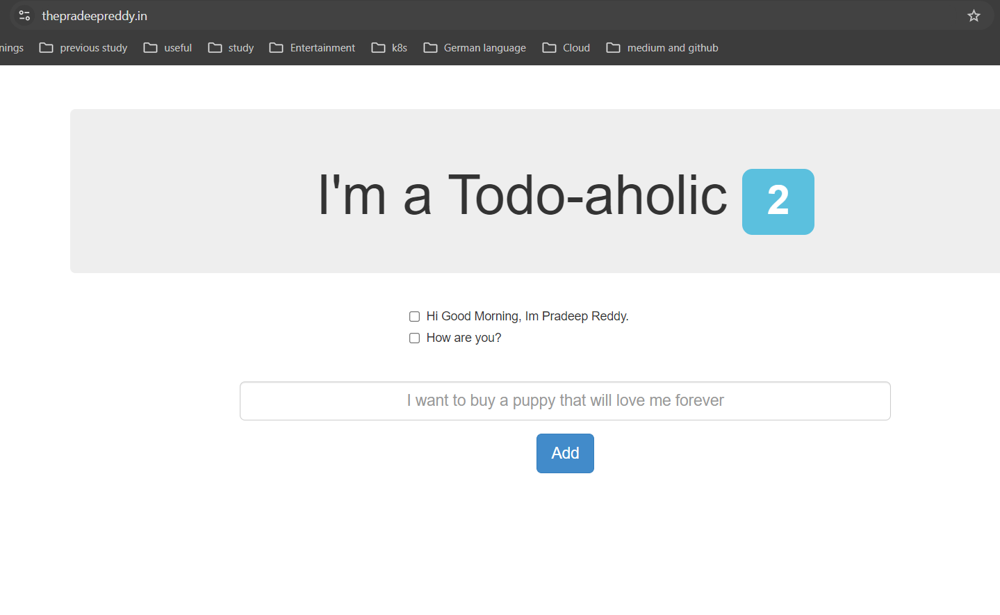

# Infrastructure Provisioning with Terraform, Node Application Deployment using ECR Image in ECS, and CI/CD Automation with GitHub Actions


This repository contains(Task 2: IaC) the infrastructure code and workflows for deploying a Node-Todo application on AWS using Terraform, ECR, and ECS. For other tasks you can check files in this repo (Task 1: Scripting = task1-backup.sh, Task 3: Processes = task3.md) Here is the sample for deployed Node-todo application.



---

## Overview

The project uses the following technologies and services:

- **Application**: Node-Todo App
- **Infrastructure as Code**: Terraform
- **Cloud Provider**: Amazon Web Services (AWS)
- **Container Registry**: Amazon Elastic Container Registry (ECR)
- **Container Orchestration**: Amazon Elastic Container Service (ECS)
- **CI/CD**: GitHub Actions

---

## Repository Structure

```
.
├── .github/workflows/   # GitHub Actions workflow files.
├── node-app/            # Node-Todo application source code.
├── node-eks-cluster/    # Node-Todo application deployment in eks-cluster using helm chart(node-app-helm-chart).
├── terraform/           # Terraform configuration files(VPC,ALB, ACM, Route53, ECR, ECS).
├── node.png/            # Sample deployement of Node-Todo application.
├── task1-backup.sh/     # It has Backup Script for task1.
├── task3.md/            # It has Process explanation for backup for task3.
└── README.md            # This file will give the whole understanding of this assignment.
```
---
## Workflows

This project uses three GitHub Actions workflows to automate the infrastructure provisioning, application deployment, and cleanup processes:

1. **Provision Infrastructure(provisioning-infra.yml)**: This workflow uses Terraform to create the necessary AWS resources.
2. **Deploy Application(build-and-deploy.yml)**: This workflow builds the Docker image, pushes it to ECR, and deploys it to ECS.
3. **Destroy Infrastructure(destroy.yml)**: This workflow destroys the provisioned AWS resources using Terraform.

### Provision Infrastructure

This workflow is responsible for creating the AWS resources required for the application:

- VPC and networking components.
- ECR repository.
- ECS cluster and task definitions.
- Load Balancer and target groups.
- ACM.
- Route53.

### Deploy Application

This workflow handles the application deployment process:

1. Builds the Docker image for the Node-Todo app.
2. Pushes the image to the ECR repository.
3. Updates the ECS service with the new image.

### Destroy Infrastructure

This workflow is used to clean up the AWS resources after testing:

- Destroys all resources created by Terraform.
- Use with caution, as it will remove all infrastructure associated with this project.

---

## Usage

1. Clone this repository.
2. Configure AWS credentials as GitHub secrets.
3. Update Terraform variables if necessary.
4. Run the "Provision Infrastructure" workflow.
5. Run the "Deploy Application" workflow.
6. Access your application using the provided Load Balancer or Domain(**If you have attached to LB).
7. When finished, run the "Destroy Infrastructure" workflow to clean up resources.

---

## Important Notes

- The "Destroy Infrastructure" workflow should be used carefully, especially in production environments. But, really not suggested to add in real time.
- Ensure that your AWS credentials are properly secured and have the necessary permissions.
- Review and adjust the Terraform configurations to match your specific requirements and best practices.

---

**Note**: In this assignment, my primary focus was on Node-todo app automating with ECS deployments using GitHub Workflows. However, I've also included a sample for an EKS cluster to demonstrate different deployment methods. The CI/CD pipeline for the EKS cluster is not included, as I tested it locally and provided the setup here for reference.

---

## For EKS Deployment (Local Testing):

- Navigate to node-eks-cluster.
- Run terraform init and terraform apply to create the EKS cluster.
- Configure kubectl to interact with your new EKS cluster.
- To deploy the application in eks cluster there is an Helm chart node-app-helm-chart.
- Install helm chart "helm install revision-name node-app-helm-chart".

---